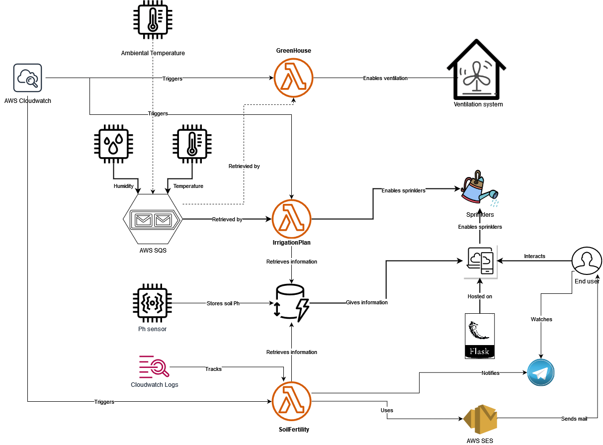

# smart-irrigation-iot
Implementation of an IoT architecture using Serverless Computing via LocalStack. 

# An infrastracture of Smart Irrigation using Serverless Computing

## Project overview

The project idea arises from the alterations in the climate and the increase of temperatures, which are causing an increase in the volumes necessary to irrigate regularly, due to the greater transpiration requirements of the crops. 
In order to implement an intelligent irrigation, the plan of irrigation needs to be estimated as precisely as possible using sensors and which can allow for the collection of all the necessary information in real time. In addition to this it is appropriate to use water as much as possible to reduce waste and the farmer's work. The project is based on an IoT Cloud architecture where several IoT sensors collect the data and send them on Cloud where they are processed through Serverless Computing and stored in a NoSQL database to be easily accessible.

To determine the irrigation demands of crops, it is necessary to determine the water balance, that is to quantify the income (rain and irrigation) and the outputs which are mainly constituted by the consumption of the soil-plant system.
In the end, for the calculation of the water balance information relating to the soil is therefore necessary, crop and meteorological parameters (like rain and temperature).

At the first, information were obtained about the water needs of the different crops through appropriate researches on the net. Those values were stored in a JSON file, which is examined by the first serverless function. Then an irrigation plan was simulated taking into about the probability of daily rain, the rain mm fallen the previous day and finally the information obtained from IoT sensors such as temperatures and soil humidity. With these information, the amount of liter of water by field is calculated and sent (through fake Http Requests) to a central system, that manages the sprinklers, and which monitors the irrigation.

Among the others functionalities we have the chance to manage greenhouses, providing an air cooling through a ventilation system, enabled automatically when the air temperature into greenhouse is two times higher than the outside temperature.

Also, we have several IoT sensor that can measure every two weeks the pH of the field, obviously, if there are problems, an email (and optionally a telegram message) is sent to the farmer to notify him about this, requiring a fertilization session of the field which presents the problem.

## Implementation overview

The IoT sensors are placed in the soil of the fields, they measure the soil temperature and soil humidity. Every day, each sensor send a message with these value on the related queue. The irrigationPlan function is triggered at 8:00 AM by AWS EventBridge with the informations retrieved from the queues, in the end with weather forecast and weather informations of the previuos day the serverless function can plan the quantity of liter for each field and send a request to the sprinklers to enable them to irrigate the crops. The pH sensor and the serverless function that treats the unfertility of the fields are triggered every 2 weeks.

Others IoT sensors are in the greenhouses to monitor the air temperature inside them every 2 hours, these data are processed by the ventilation serverless function which can enable the ventilation system if it's needed. 

To understand the goodness of the solution, the quantity of water saved for each day, is stored in a NoSql database (DynamoDB). Also informations of fields like dimensions and crop type are stored into db.

The farmer can watch and manage these informations (weather forecast, fields info, crops info and water saved by month) on a dashboard, with his smartphone or laptop, easily reachable through a simple web browser. Also, he can start and plan his sprinklers for a specified field manually.

## Architecture

* IoT devices: Simulated using a Python script, with boto3. They measure every day soil humidity and soil temperature.
* AWS SQS: Used to store the messages of IoT sensors, then, these informations are retrieved by the serverless function.
* AWS Lambda: Offers the environment where the serverless function is deployed.
* AWS CloudWatch: Implements the rule, through EventBridge, which invoke the serverless function every day.
* AWS DynamoDB: Utilized to store data, in particular, the quantity of water saved every day and the informations relative to fields, crop type and mq available.
* Flask: Web server which allows the use of python as backend programming language.
* AWS SES: Used to send the mail to farmer.
* Cloudwatch logs: Tracks the e-mails sent.

## Installation and usage

### Prerequisities

1. Docker
2. AWS CLI
3. boto3
4. Flask
5. (Optional) nodejs for database interface
6. (Optional) telegram bot

### Setting up the environment

1. Clone the repository
        
        git clone https://github.com/davideiov/smart-irrigation-iot.git
        
2. Launch LocalStack
        
        docker run --rm -it -p 4566:4566 -p 4571:4571 localstack/localstack
        
3. Create and check the SQS queue for humidity and temperature

        aws sqs create-queue --queue-name humidity --endpoint-url=http://localhost:4566
        aws sqs create-queue --queue-name temperature --endpoint-url=http://localhost:4566
        aws sqs create-queue --queue-name ventilation --endpoint-url=http://localhost:4566
        aws sqs list-queues --endpoint-url=http://localhost:4566

4. Create tables of DynamoDB, if you want check with the last command

        python3 code/db.py
        DYNAMO_ENDPOINT=http://0.0.0.0:4566 dynamodb-admin
        
and then go to

        http://localhost:8001

5. Verify email identity
        
        aws ses verify-email-identity --email-address sender@example.com --endpoint-url=http://localhost:4566
   
6. Edit the values into the config.py file (location and email of farmer)
 
7. Require an api-key from https://www.visualcrossing.com/resources/documentation/weather-api/timeline-weather-api/ and put into the config.py
8. Create the time-triggered Lambda functions to elaborate the data      
>  1. Create the role
           
        aws iam create-role --role-name lambdarole --assume-role-policy-document file://code/role_policy.json --query 'Role.Arn' --endpoint-url=http://localhost:4566
        
>  2. Attach the policy       

        aws iam put-role-policy --role-name lambdarole --policy-name lambdapolicy --policy-document file://code/policy.json --endpoint-url=http://localhost:4566

>  3. To create the zip file, move with the shell in the folder named 'code'       

        cd code
        zip smartIrrigation.zip function.py config.py fabbisogni.json

>  4. Create the function and save the Arn (it should be something like arn:aws:lambda:us-east-2:000000000000:function:smartIrrigation)         
        
        aws lambda create-function --function-name smartIrrigation --zip-file fileb://smartIrrigation.zip --handler function.lambda_handler --runtime python3.8 --role arn:aws:iam::000000000000:role/lambdarole --endpoint-url=http://localhost:4566

>  4b. If you want invoke the lambda function manually, at the first generate the random values of sensors and then invoke the serverless function
        
        python3 sensors.py
        aws lambda invoke --function-name smartIrrigation out --endpoint-url=http://localhost:4566

>  5. Set up a CloudWatch rule to trigger the lambda function every day at 8:15
>>   1. Create the rule and save the Arn (it should be something like arn:aws:events:us-east-2:000000000000:rule/everyDay)       
   
        aws events put-rule --name everyDay --schedule-expression 'cron(15 8 * * ? *)' --endpoint-url=http://localhost:4566

>>    2. Check that the rule has been correctly created with the frequency wanted       

        aws events list-rules --endpoint-url=http://localhost:4566

>>   3. Add permissions to the rule        
  
        aws lambda add-permission --function-name smartIrrigation --statement-id everyDay --action 'lambda:InvokeFunction' --principal events.amazonaws.com --source-arn arn:aws:events:us-east-2:000000000000:rule/smartIrrigation --endpoint-url=http://localhost:4566

>>    4. Add the lambda function to the rule using the JSON file containing the Lambda function Arn       

        aws events put-targets --rule everyDay --targets file://targets.json --endpoint-url=http://localhost:4566      
>    Well done! Now every day, the serverless function will be triggered, check this into dashboard!

### Setting telegram bot

1. Create a new bot requiring it from BotFather through telegram.
2. Obtain your bot_id from https://api.telegram.org/bot<YOUR_TOKEN>/getUpdates.
3. Open config.py and edit the fields: BotUse = "true", BotToken = <YOUR_TOKEN>, BotId = <YOUR_ID>.

### Use it

1. Simulate the IoT devices   
>         python3 code/soil_sensors.py (for irrigationPlan serverless function)
>         python3 code/greenhouse_sensor.py (for ventilation serverless function)
>         python3 code/ph_sensor.py (for soilFertility serverless function)
2. Wait the invokation of Lambda functions or invoke it manually.
3. Run flask with the command 
>         flask run
4. Go to the website and see the informations what you want.

## Future improvements

* GUI improvements: add more functionalities to website.
* Extend iot network: improving the accuracy of the plan of irrigation.
* Add crops info: adding information of crops like favorite season for colture, etc…
* Add an harvest plan: improving the quality of the fields and the quantity of the harvest.
